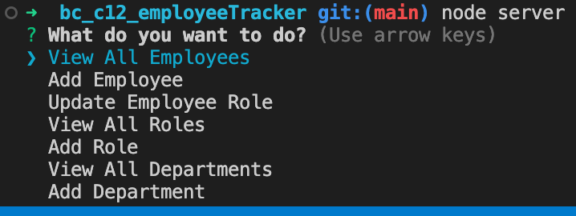

# Employee Tracker[License: MIT)](https://img.shields.io/badge/License-MIT-yellow.svg)
    
## Description

> ### What was your motivation?
> To learn how to use sql tables

> ### Why did you build this project?
> To prepare to build crms

> ### What problem does it solve?
> Making creating, viewing, updated, and deleting employees in a database easy

> ### What did you learn?
> Javascript interacting with mysql. Using Inquierer for SQL commands
  

## Table of Contents
- [Installation](#installation)
- [Usage](#usage)
- [License](#license)
- [Contributing](#contributing)
- [Tests](#tests)

## Installation
- npm mysql2
npm inquirer

## Usage
Run node server.js in your terminal to start the inquirer.

## License
MIT License Info.

## Badges

## Contributing
No one at the moment.

## Tests
Rodolfo Espinosa Nunez

## Questions for me?
Shoot me an email to rodolfoespinosa01@gmail.com

## Github Profile
Visit my Github profile!
https://github.com/rodolfoespinosa01

## Project Repo
https://github.com/rodolfoespinosa01/bc_c12_employeeTracker

## Video walkthrough
N/A